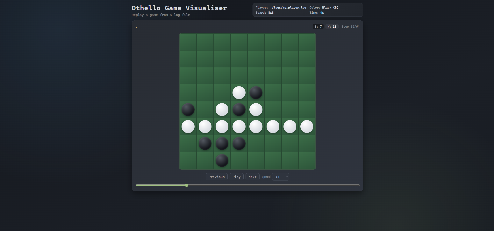

# Othello Game Visualiser



### Install

```bash
npm install
```

### Run

```bash
node server.js
```

Open `http://localhost:3000` in your browser

### Live play vs local opponent

#### Local test harness setup (required for referee mode)

Clone the local test harness into `tools/te-local-test-harness`:

```bash
git clone git@git.cs.sun.ac.za:Computer-Science/rw314/te/te-local-test-harness.git tools/te-local-test-harness
```

The server will copy `comms.h` into `tools/opponent_adapter/` before compiling the referee bridge.

You can play against a local opponent from the browser. The server supports two modes:

- Local referee mode (default): uses the local test harness referee with a `.c` opponent source file.
- Adapter mode: runs a binary that implements the adapter protocol described below.

In local referee mode, the UI always plays Black because the local referee starts the player as Black.

The server accepts either:

- A `.c` source file that defines `opponent_initialise`, `opponent_apply_move`, and `opponent_gen_move` (for example,
  [temp/te-local-test-harness/src/local_opponent.c](temp/te-local-test-harness/src/local_opponent.c)).
- A precompiled opponent binary that speaks the adapter protocol described below.

When you enter a `.c` file path, the server will compile it using a C compiler (uses `CC` if set, otherwise tries `gcc`, `clang`, then `cc`). The compiled binary is cached under
`tools/opponent_adapter/bin/`.

#### Opponent adapter protocol

The opponent process is started once and receives line-based commands on stdin:

```text
init <color>
apply <move>
gen
quit
```

- `color` is `1` for Black or `2` for White (matches the local harness constants).
- `move` is the 0–63 index (`row * 8 + col`), or `-1` for pass.
- `gen` must output a single line with the chosen move index (or `-1`).

If you only provide a binary and it does not implement the adapter protocol, local referee mode will not work because it needs the opponent source code to compile.
